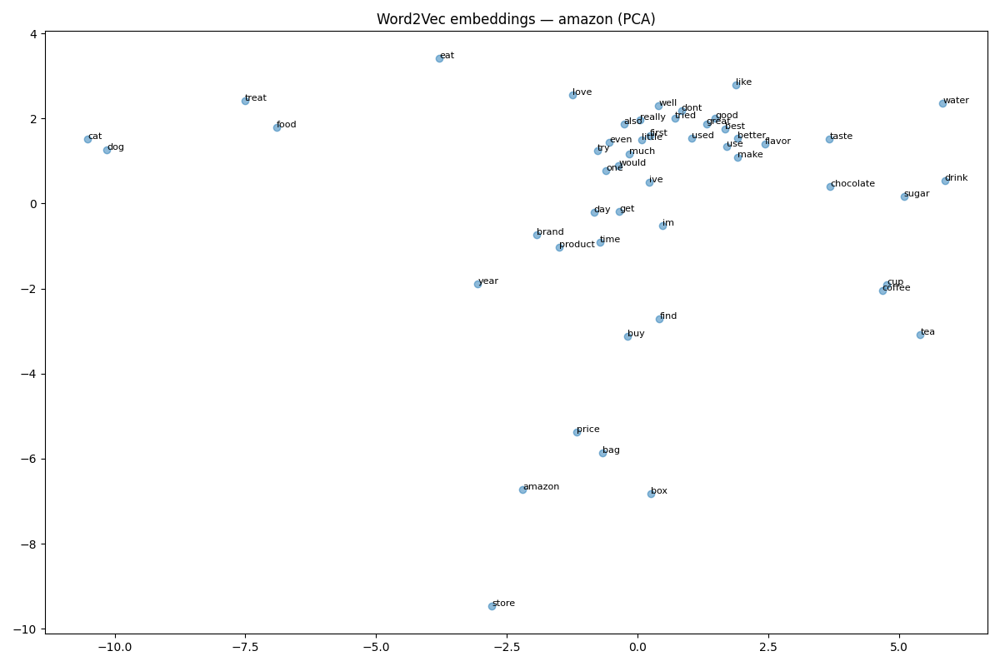
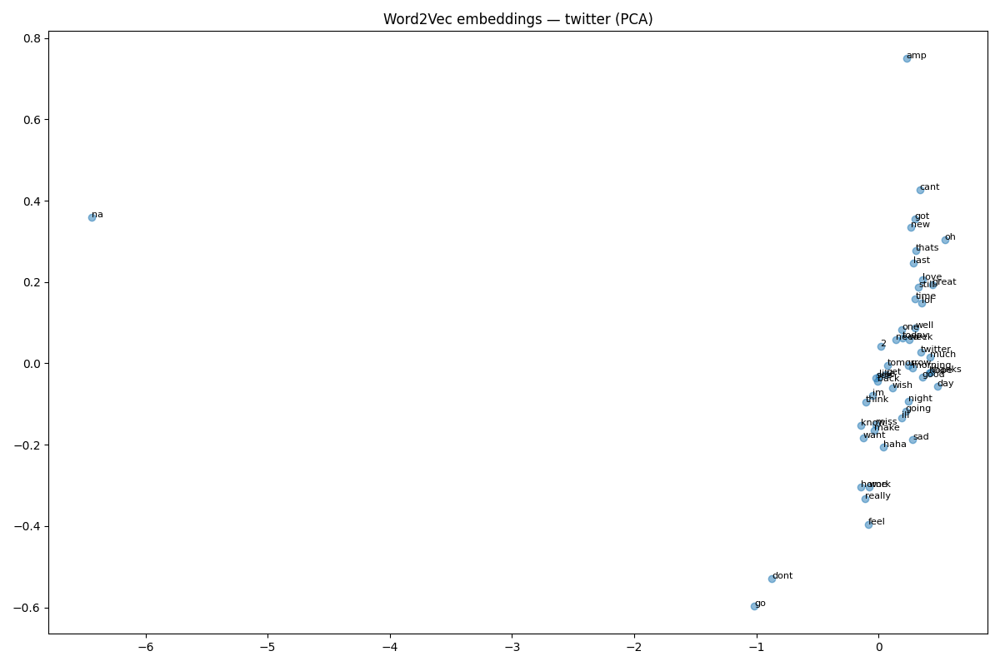

# NLP Lab 1 — Intelligence System: From Raw Text to Production

---

## Project Overview

A fully operational sentiment classifier and search engine built on two real-world noisy datasets, designed, tracked, and deployed as a production-grade ML system.

**Datasets:**
- Amazon Fine Food Reviews — 500K+ long-form product reviews, clean and structured
- Sentiment140 — 1.6M tweets, short, noisy, informal

---

## Results Summary

| Dataset | Vectorizer | Accuracy |
|---------|-----------|----------|
| Amazon | BoW | 92.3% |
| Amazon | TF-IDF | 91.5% |
| Twitter | BoW | 75.1% |
| Twitter | TF-IDF | 75.8% |

---

## Vectorization Analysis

### Why Amazon outperforms Twitter (92% vs 75%)

| Factor | Amazon Reviews | Twitter Tweets |
|--------|---------------|----------------|
| Length | 100+ words | 10-15 words |
| Language | Clean, formal | Noisy, slang, emojis |
| Signal | Rich vocabulary | Sparse vocabulary |
| Structure | Full sentences | Abbreviations, hashtags |

More words = more signal for the model. Tweets are too short and noisy — the model does not have enough to work with.

### BoW vs TF-IDF

**BoW (Bag of Words):**
Counts how many times each word appears.
- "good good great" → good=2, great=1
- Problem: common words like "the", "is" get high counts even though they carry no meaning

**TF-IDF:**
Counts words but punishes common words and rewards rare ones.
- "good" appears in every review → low score
- "disgusting" appears rarely → high score
- Rare words carry more meaning

### Why BoW beat TF-IDF on Amazon (92.3% vs 91.5%)

Amazon reviews are already clean and specific. Raw word counts were informative enough. TF-IDF's penalty on common words did not help — the signal was already strong.

### Why TF-IDF beat BoW on Twitter (75.8% vs 75.1%)

Tweets are noisy and full of filler words. TF-IDF's ability to focus on rare meaningful words gave a small but consistent advantage. The gap is small because both methods struggle equally with short text.

### Key Engineering Decisions

- Used lemmatization on Amazon reviews — longer text benefits from proper word normalization
- Stemming would be faster but loses meaning on rich vocabulary
- Both methods plateau around 75% on Twitter — the ceiling is the data quality, not the algorithm

---

## Word Embeddings Analysis

### Amazon Fine Food Reviews

The Amazon embeddings show clear semantic clustering:
- Food-related words cluster together: coffee, tea, chocolate, drink, water
- Pet food terms cluster separately: cat, dog, treat, food
- Sentiment words cluster together: good, great, best, better
- Purchase terms cluster: buy, price, store, brand

This shows Word2Vec successfully learned domain meaning from clean, long-form text.

### Sentiment140 (Twitter)

The Twitter embeddings show poor clustering:
- Most words pile up in one dense blob in the center-right
- No clear semantic groups emerge
- amp is an isolated outlier (HTML entity &amp; not fully cleaned)
- na is isolated — slang not seen enough to cluster meaningfully

This shows Word2Vec struggles on short, noisy, informal text.

### Similar Words Comparison

| Word | Amazon similar | Twitter similar |
|------|---------------|-----------------|
| good | decent, great, fantastic | great, sunny, saturday, lovely |
| bad | terrible, horrible, weird | head, woke, b, saturday |
| love | — | awesome, ur, thanks, cool |
| hate | — | w, there, hard, many |

Amazon: "bad" correctly clusters with "terrible", "horrible" — meaningful sentiment neighbors.
Twitter: "bad" clusters with "head", "woke", "saturday" — completely meaningless.

### What Classical Vectors Cannot Capture

| Limitation | Example |
|------------|---------|
| Synonyms | BoW treats "good" and "great" as completely different features |
| Context | "bank" (river) vs "bank" (money) — identical BoW vector |
| Meaning distance | BoW has no concept that "terrible" is closer to "bad" than to "food" |
| Morphology | BoW treats "run", "running", "ran" as 3 different words |

Word2Vec learns that taste and flavor are similar because they appear in similar contexts — BoW simply cannot do this.

---

## Pipeline Architecture

    Raw Text
        ↓
    TextPreprocessor
    (lowercase, remove URLs/HTML/punctuation, stopwords, lemmatize)
        ↓
    Vectorizer (BoW / TF-IDF / BM25)
        ↓
    Classifier (Logistic Regression)
    → Sentiment: Positive / Negative
        ↓
    MLflow
    (tracks all experiments, saves best model)
        ↓
    FastAPI
    (serves classifier + BM25 search engine)
        ↓
    Docker
    (containerized, production-ready)

---

## MLOps

- Data versioned with DVC — large files never touch Git
- Every experiment logged to MLflow (params, metrics, model artifacts)
- Best model registered in MLflow model registry
- API loads model directly from MLflow at startup

---

## API Endpoints

- POST /classify — input text → sentiment + confidence score
- GET /search — query + sentiment filter → ranked BM25 results
- GET /health — service health check

---

## Project Structure

    nlp_lab1/
    ├── data/
    │   ├── raw/          # DVC-tracked datasets
    │   └── processed/
    ├── models/           # saved Word2Vec + classifier models
    ├── notebooks/        # embedding visualizations
    ├── src/
    │   ├── preprocessor.py
    │   ├── vectorizer.py
    │   ├── embeddings.py
    │   ├── classifier.py
    │   └── search_engine.py
    ├── api/
    │   └── main.py
    ├── Dockerfile
    └── README.md